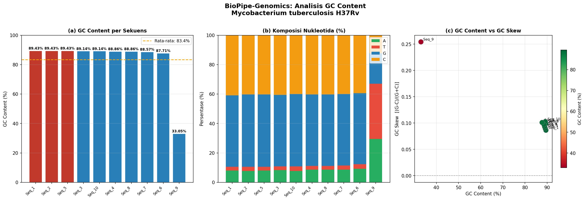

# 🧬 BioPipe-Genomics

> **Pipeline Analisis Komposisi Nukleotida dan Visualisasi GC Content**  
> Mata Kuliah: Struktur Data Bioinformatika (BIF1223) · IPB University · Pertemuan #15

---

## 📋 Deskripsi Proyek

BioPipe-Genomics adalah pipeline bioinformatika berbasis Python yang dirancang untuk menganalisis komposisi nukleotida sekuens genomik. Pipeline ini mengintegrasikan berbagai **struktur data** fundamental (List, Dictionary, Sorting) untuk memproses file FASTA secara otomatis dan menghasilkan visualisasi serta laporan CSV.

**Organisme:** *Mycobacterium tuberculosis* H37Rv  
**Sumber Data:** [NCBI – NC_000962.3](https://www.ncbi.nlm.nih.gov/nuccore/NC_000962.3)

---

## 🎯 Fitur Utama

| Fitur | Struktur Data | Keterangan |
|-------|--------------|------------|
| Baca file FASTA/FASTQ | **List** | Menyimpan sekuens ke dalam list of dict |
| Hitung frekuensi nukleotida | **Dictionary** | Iterasi A, T, G, C per sekuens |
| Urutkan berdasarkan GC | **Sorting** | `sorted()` dengan Timsort (O n log n) |
| Tampilkan 3 terbaik | List slicing | Top-N dengan GC Content tertinggi |
| Visualisasi grafik | Matplotlib | 3-panel: bar, stacked bar, scatter |
| Ekspor hasil | CSV | Tabel lengkap dengan semua metrik |

---

## 📂 Struktur Repositori

```
BioPipe-Genomics/
│
├── data/
│   └── sequences.fasta          # File FASTA (M. tuberculosis H37Rv)
│
├── src/
│   └── biopipe_analysis.py      # Script utama pipeline Python
│
├── output/
│   ├── gc_analysis_visualization.png  # Grafik hasil analisis
│   └── nucleotide_analysis_results.csv  # Tabel hasil analisis
│
├── docs/
│   └── laporan_mini_project.pdf # Laporan mini project (PDF)
│
├── requirements.txt             # Dependensi Python
└── README.md                    # Dokumentasi ini
```

---

## 🚀 Cara Menjalankan

### 1. Clone Repositori
```bash
git clone https://github.com/fannikhahaendzikriany/BioPipe-Genomics.git
cd BioPipe-Genomics
```

### 2. Install Dependensi
```bash
pip install -r requirements.txt
```

### 3. Jalankan Pipeline
```bash
python src/biopipe_analysis.py
```

### 4. Lihat Hasil
- Grafik: `output/gc_analysis_visualization.png`
- Data CSV: `output/nucleotide_analysis_results.csv`

---

## 🔬 Penjelasan Teknis

### Tahap 1 – Membaca File FASTA (List)
```python
sequences: list[dict] = []   # List untuk menyimpan semua sekuens

# Setiap elemen: {'id': str, 'description': str, 'sequence': str}
sequences.append({
    'id': current_id,
    'description': current_desc,
    'sequence': ''.join(current_seq).upper()
})
```

### Tahap 2 – Frekuensi Nukleotida (Dictionary)
```python
freq: dict = {'A': 0, 'T': 0, 'G': 0, 'C': 0, 'other': 0}

for nucleotide in sequence:
    if nucleotide in freq:
        freq[nucleotide] += 1
```

### Tahap 3 – Perhitungan GC Content
```
         G + C
GC% = ————————————— × 100
       A + T + G + C
```

### Tahap 4 – GC Skew (Bonus)
```
            G − C
GC Skew = ————————
            G + C
```
GC Skew digunakan untuk mengidentifikasi **origin of replication** pada kromosom bakteri.

### Tahap 5 – Sorting
```python
sorted_results = sorted(results, key=lambda x: x['gc_content'], reverse=True)
```

---

## 📊 Hasil Visualisasi



**Panel (a):** Bar chart GC Content per sekuens — garis oranye menunjukkan rata-rata  
**Panel (b):** Komposisi nukleotida (A/T/G/C) dalam persen — stacked bar  
**Panel (c):** Scatter plot GC Content vs GC Skew untuk identifikasi replikasi

---

## 📈 Hasil Analisis (Top 3 Sekuens)

| Rank | Sequence ID | GC Content | AT Content | GC Skew | Length |
|------|------------|-----------|-----------|---------|--------|
| #1 | NC_000962.3_1 | 89.43% | 10.57% | 0.0863 | 350 bp |
| #2 | NC_000962.3_2 | 89.43% | 10.57% | 0.0990 | 350 bp |
| #3 | NC_000962.3_5 | 89.43% | 10.57% | 0.0990 | 350 bp |

**Rata-rata GC Content:** 83.36%  
> *Fragmen sekuens yang dianalisis pada mini project ini memiliki GC Content yang relatif tinggi. Nilai tersebut dapat berbeda dari GC Content rata-rata genom Mycobacterium tuberculosis secara keseluruhan (~65,6%) karena analisis dilakukan pada fragmen sekuens tertentu, bukan seluruh genom.*

---

## 📦 Requirements

```
matplotlib>=3.5.0
biopython>=1.79
```

---

## 👨‍💻 Informasi

**Mata Kuliah:** Struktur Data Bioinformatika (BIF1223)  
**Dosen:** Toto Haryanto  
**Institusi:** IPB University – Bogor, Indonesia  
**Pertemuan:** #15 Integrasi Struktur Data untuk Pipeline Analisis Sederhana  
**Deadline:** 27 Juni 2026

---

## 📚 Referensi

- [NCBI Nucleotide Database – NC_000962.3](https://www.ncbi.nlm.nih.gov/nuccore/NC_000962.3)
- Chitale P, Lemenze AD, Fogarty EC, Shah A, Grady C, Odom-Mabey AR, Johnson WE, Yang JH, Eren AM, Brosch R, et al. 2022. A comprehensive update to the Mycobacterium tuberculosis H37Rv reference genome. Nat Commun. 13:7068. doi:10.1038/s41467-022-34853-x.
- Cuevas-Córdoba B, Fresno C, Haase-Hernández JI, Barbosa-Amezcua M, Mata-Rocha M, Muñoz-Torrico M, Salazar-Lezama MA, Martínez-Orozco JA, Narváez-Díaz LA, Salas-Hernández J, et al. 2021. A bioinformatics pipeline for Mycobacterium tuberculosis sequencing that cleans contaminant reads from sputum samples. PLoS ONE. 16(10):e0258774. doi:10.1371/journal.pone.0258774.
- Vera-Cabrera L, Molina-Torres CA, Lopez-Ortiz JM, Castro-Garza J, Cordova-Fletes C, Ocampo-Candiani J. 2020. Complete genome sequences of Mycobacterium tuberculosis isolates subjected to 200 continuous passages. Microbiol Resour Announc. 9(26):e00356-20.
